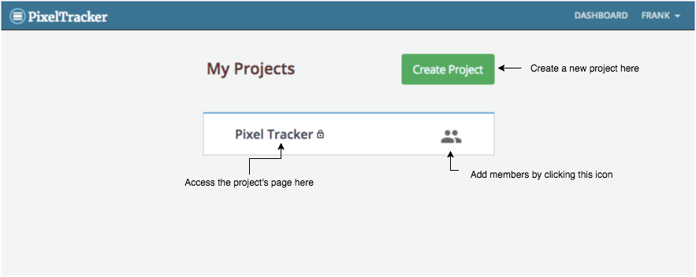
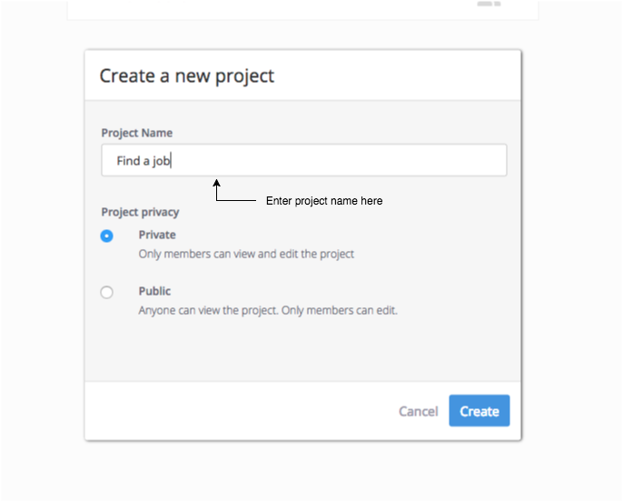
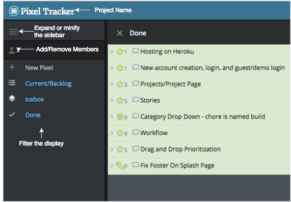
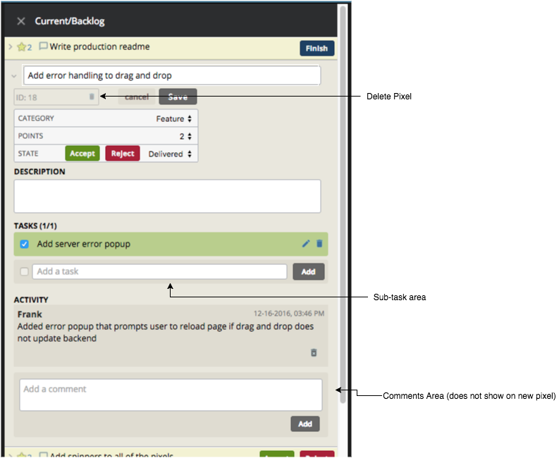
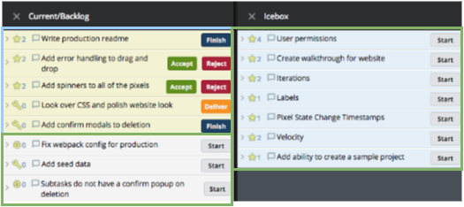

# Pixel Tracker
[Pixel Tracker Live](https://pixel-tracker1.herokuapp.com)

Pixel Tracker is a full-stack web application that is a clone of the project management tool Pivotal Tracker. Pixel Tracker uses Ruby on Rails and PostgreSQL as its backend, and React/Redux, utilizing the react-redux library and thunk middleware, on the frontend.   

## Features

### Projects and Dashboard

The dashboard contains all of the user's projects. This is achieved through a join table that contains a user_id and project_id that keeps track of who is a member of the project. Upon entering the dashboard, the frontend will send an AJAX request to the rails API routes to fetch all of the projects that the user has.

Users are able to create projects and add members on this page. Clicking on project name will take them to the project page.

Projects require a name, and also the user can select if the project is private or public. By default projects are private. Anyone trying to access private page that is not a member will get a not found page. Private projects will be indicated with a lock icon next to the name. The projects and member modals are created with react-modal.

### Project Page

Upon entering a project page, the app will check if the project id exists in the current redux state. If it does not, it will make an api request to grab just that one project. This is helpful when navigating directly to the project route and not through the dashboard.

On this page you can also directly add/remove members from the project. Click on the filters will change which panels are visible. There is also the option to open the create new Pixel form. This will always open the icebox and open the form there.

The sidebar filters change a redux state that the panel container reads from and only displays the proper panels. The icebox panel looks specifically for the new pixel state.

### Pixels (Stories/Tickets)

Pixels are the equivalent to Pivotal's stories. These are tickets in the project that are created by members. Upon entering the project page, there is an API request to grab all of the projects pixels and it stores them as an options has in the store. Users can see a more detailed view by hovering over the small message box icon to the left of the pixel title.

Users can both create and edit the pixel directly inside of the panels. Update and creation sends an AJAX request to the rails API which returns the updated pixel object, which updates the redux state.

Points can only be assigned to features. The state will always default to Unstarted. Users can select 4 categories of the pixel (feature(default), bug, chore, release).

Subtasks can be added and removed on both an existing pixel or a new pixel. This is accomplished by using the nested_attribues function in rails. Creating a new pixel stores the tasks in a redux state and sends them off with the new pixel object when the user clicks save.

Comments/Activity does not show up when creating a new pixel. They are enabled when the pixel is created. Both subtasks and comments can be edited. Comments can only be edited by the user that created them.

### Workflow

Pixel tracker follows the same workflow as Pivotal Tracker. The frontend is concerned about three properties of each pixel object: _state_, _ord_ and _icebox_. The panels will only select the proper pixels based on state and icebox, and order them by their ord.

States can be changed directly in the form or through buttons in both the form and in the regular view. In order to deal with pixels being in the right order, a max ord for each of the panels are saved in the redux state. This ensures any new pixels or updated state pixels are placed in the proper order in their new panels.

### Drag and Drop Prioritization

Drag and drop is implemented using the react-dnd library. Pixels can only be dragged to the proper section. Unstarted pixels can be dragged to and from the icebox. Dragging into the bottom of the panel will put the unstarted pixel at the bottom of the list.

Accepted pixels cannot be drag and dropped. Other pixels cant be dragged and dropped in their own panel; they must always be on top of the unstarted pixels.

When the order is changed, the frontend dispatches and updates the redux state, then sends an AJAX request to the API using a custom route, utilizing the rails update function to mass update the ords of the pixels in the panel. If this fails, an error prompt will open and ask the user to refresh the page.

## Future Features

There are many features that would improve this app that I would like to implement.

### User Permissions

Currently all members have full access to all projects. There should be access levels (i.e. admin, member, viewer).

### Labels

Pixels should be able to have labels attached to them. Filtering by labels will create a new panel that only has pixels in it with that label.

### Iterations

Panels should have sprints. Pixels should be organized properly by which sprint they are in.
